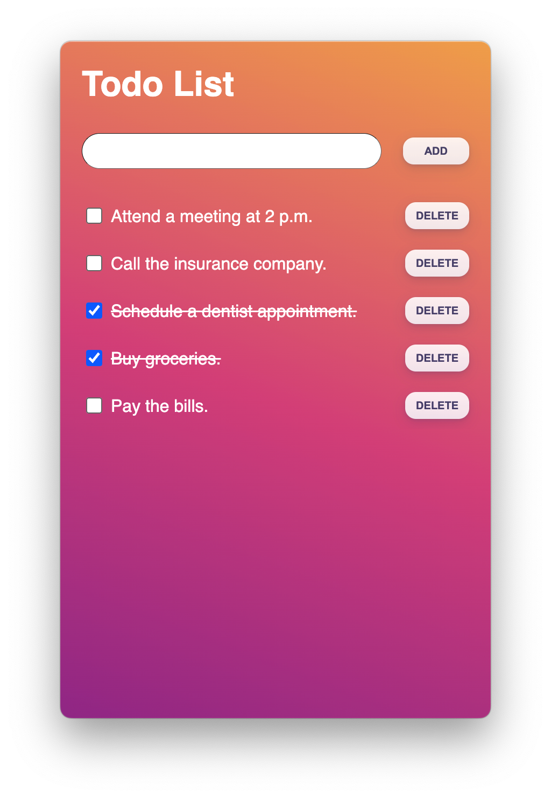
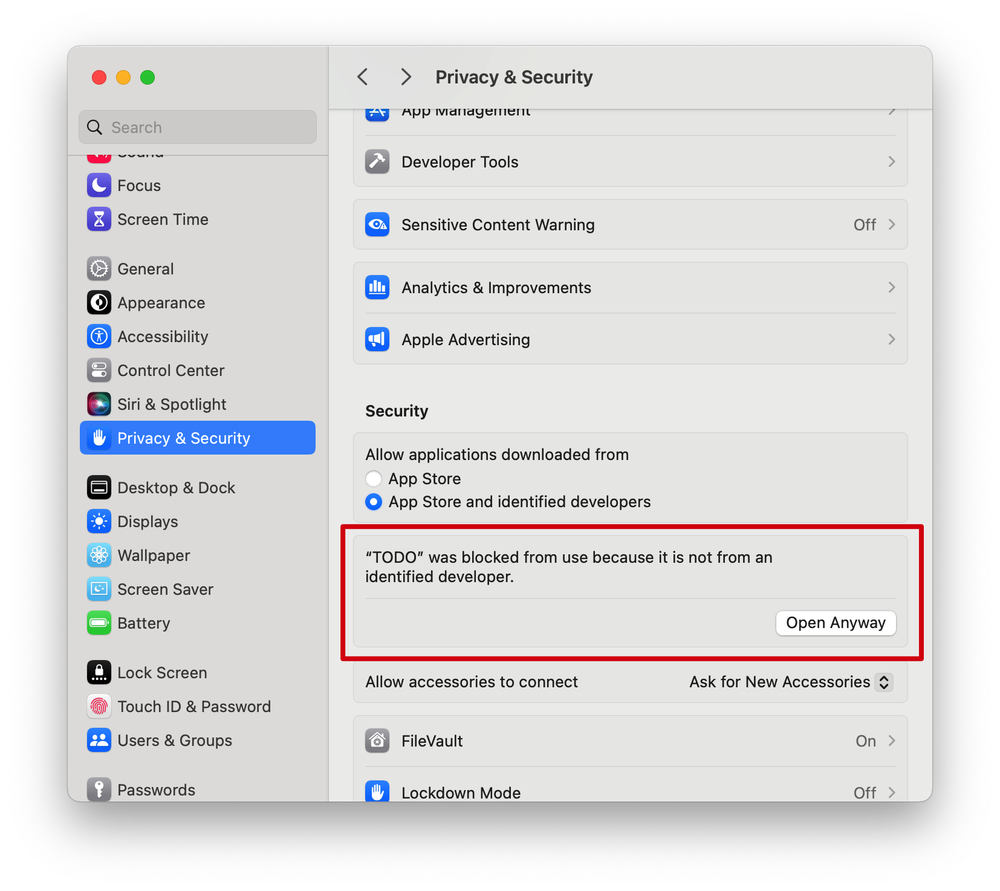

# [TO-DO](https://github.com/xs0521/TO-DO)

> easy to-do



## Support

System Support： 

## Download

The latest official **installers** and **portable versions** for macOS can be found at [Github Releases](https://github.com/xs0521/EasyYeelight/releases) page.

## Install

### macOS

#### 1、Application Signing

*EasyYeelight* is not signed (due to its costs) so you will need to use a workaround for the first run. The workaround depends on if you're running an Intel or Apple Silicon chip.

- **Intel Chips**: [Open a Mac app from an unidentified developer](https://support.apple.com/guide/mac-help/open-a-mac-app-from-an-unidentified-developer-mh40616/mac).
- **Apple Chips**: Open a terminal and run this command:

```
    sudo xattr -r -d com.apple.quarantine /Applications/TODO.app
```

2、Double-click, and then open it in the system



### Windows

Download and Double-click

## Feedback

Find a bug or have a feature request? Please file an <a href="https://github.com/xs0521/TO-DO/issues" targe="_blank">issue</a>!

## Features

- [x] add
- [x] delete
- [x] mark
- [x] save
- [ ] synchronization
- [ ] notification
- [ ] collaboration

## Update

2024-03-30

- windows

2024-01-30

- macos

## Thanks


